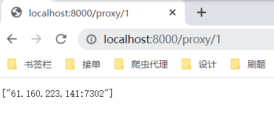
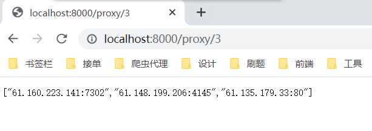
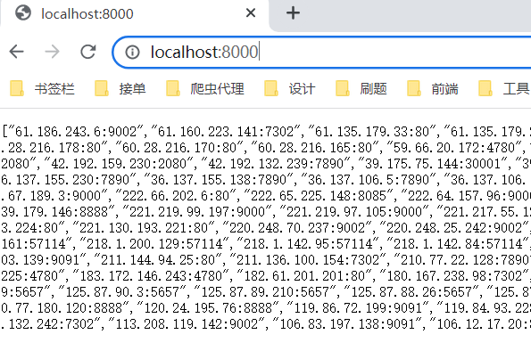
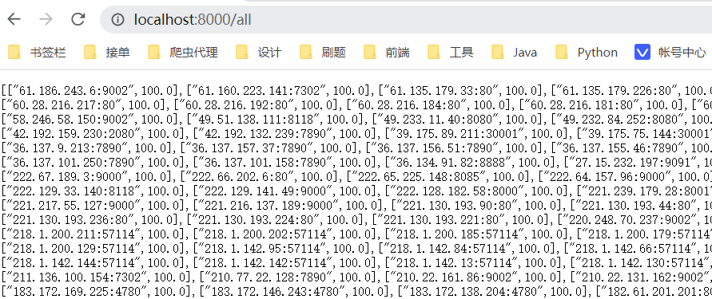

# 程序说明：

项目运行后，

一个进程去爬取网页代理存入redis，

四个进程去随即检测redis中的代理，进行评分（数量可修改，评分规则可修改）

一个进程运行flask框架，提供接口

# 评分规则说明

## 初始规则

入库初试分数为50，检测时连接成功直接为100，失败每次减30，分数小于0从数据库中删除，

# 接口说明

获取前n个100分代理：

获取所有满分代理：`http://localhost:8000/`

获取所有代理：`http://localhost:8000/all`

# 借鉴说明

## 项目借鉴于[https://github.com/qiyeboy/IPProxyPool](https://github.com/qiyeboy/IPProxyPool)

